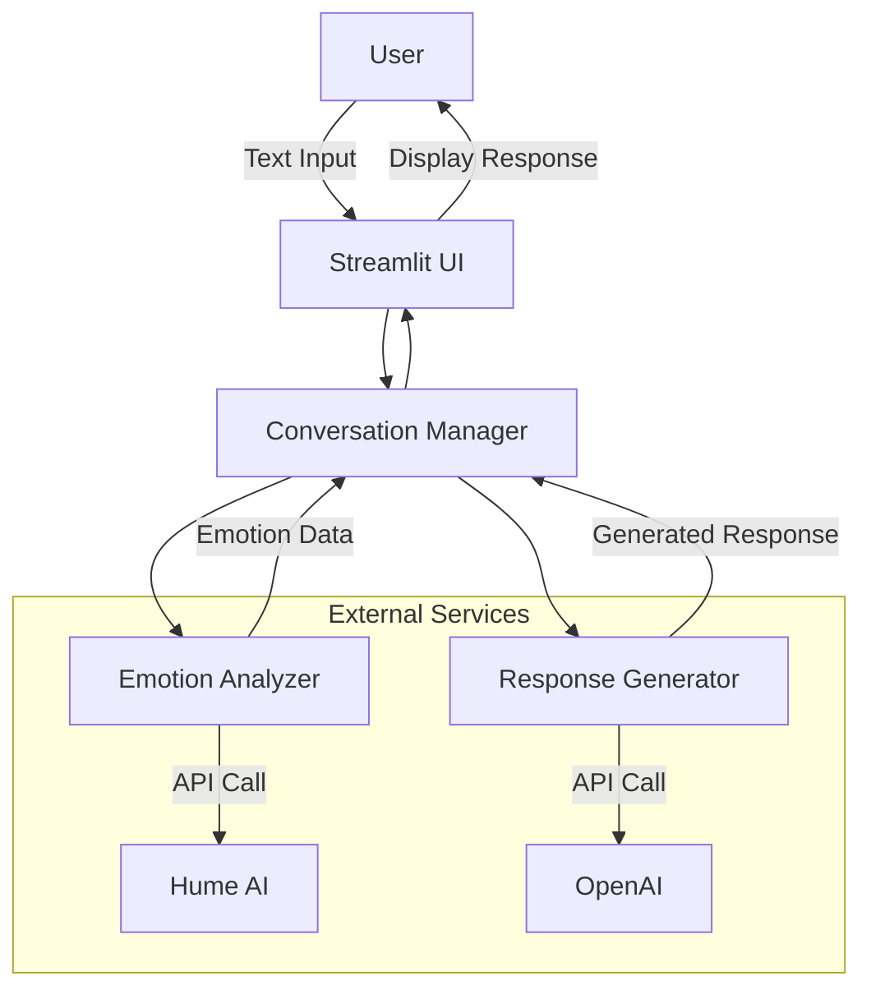

# System Architecture

## Overview

The Conversational Emotion AI is a sophisticated system that combines natural language processing with emotion analysis to create empathetic and context-aware conversations. The architecture is designed to be modular, scalable, and maintainable.

## High-Level Architecture

## Core Components

### 1. Emotion Analyzer

**Responsibilities**:
- Interface with Hume AI's emotion analysis API
- Process text to extract emotional tone
- Normalize and structure emotion data
- Handle API errors and rate limiting

**Key Classes**:
- `EmotionAnalyzer`: Main class for emotion analysis operations

**Dependencies**:
- Hume AI API
- `httpx` for async HTTP requests

### 2. Conversation Manager

**Responsibilities**:
- Maintain conversation state and history
- Manage message storage and retrieval
- Handle conversation persistence
- Track emotion history

**Key Classes**:
- `ConversationManager`: Manages conversation state
- `Message`: Data class for message representation

**Dependencies**:
- None (pure Python)

### 3. Response Generator

**Responsibilities**:
- Generate contextually appropriate responses
- Incorporate emotional context into responses
- Handle conversation flow and coherence
- Manage API interactions with OpenAI

**Key Classes**:
- `ResponseGenerator`: Handles response generation logic

**Dependencies**:
- OpenAI API
- `openai` Python package

### 4. Web Interface (Streamlit)

**Responsibilities**:
- Provide user-friendly chat interface
- Display conversation history
- Visualize emotion analysis
- Handle user input

**Key Files**:
- `app.py`: Main application entry point

**Dependencies**:
- Streamlit
- Plotly for visualizations

## Data Flow

1. **User Input**:
   - User enters text in the Streamlit interface
   - Message is sent to the Conversation Manager

2. **Emotion Analysis**:
   - Conversation Manager sends text to Emotion Analyzer
   - Emotion Analyzer processes text through Hume AI API
   - Emotion data is returned and stored with the message

3. **Response Generation**:
   - Conversation history and emotion data are sent to Response Generator
   - Response Generator formulates appropriate prompt for OpenAI
   - Generated response is returned to Conversation Manager

4. **Response Display**:
   - Response is added to conversation history
   - Updated conversation is displayed to user
   - Emotion data is visualized (if applicable)

## Configuration

The system is configured through multiple mechanisms:

1. **Environment Variables** (`.env`):
   - API keys
   - Service endpoints
   - Runtime settings

2. **YAML Configuration** (`config/emotions_config.yaml`):
   - Emotion detection thresholds
   - Response strategies
   - Model parameters

## Error Handling

- **API Errors**: Graceful degradation when external services are unavailable
- **Input Validation**: Comprehensive validation of all inputs
- **Rate Limiting**: Backoff and retry logic for API calls
- **Logging**: Structured logging for debugging and monitoring

## Security Considerations

- API keys are never stored in version control
- Environment variables are used for sensitive configuration
- Input sanitization to prevent injection attacks
- Rate limiting to prevent abuse

## Performance Considerations

- Asynchronous API calls to prevent blocking
- Caching of common responses
- Efficient data structures for conversation history
- Batch processing where applicable

## Future Extensions

1. **Multi-modal Input**: Support for voice and image analysis
2. **Custom Models**: Fine-tuned models for specific domains
3. **Plugins**: Extensible architecture for additional features
4. **Analytics Dashboard**: Detailed conversation analytics
5. **Multi-language Support**: Support for non-English languages
